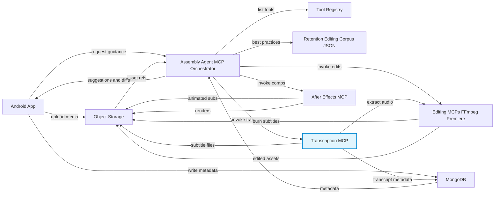
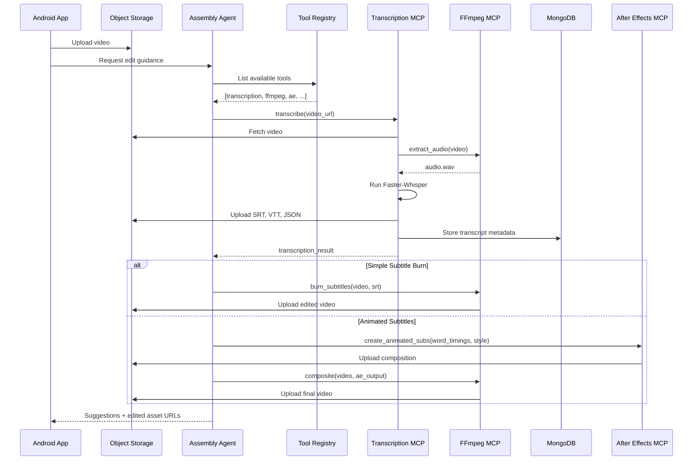
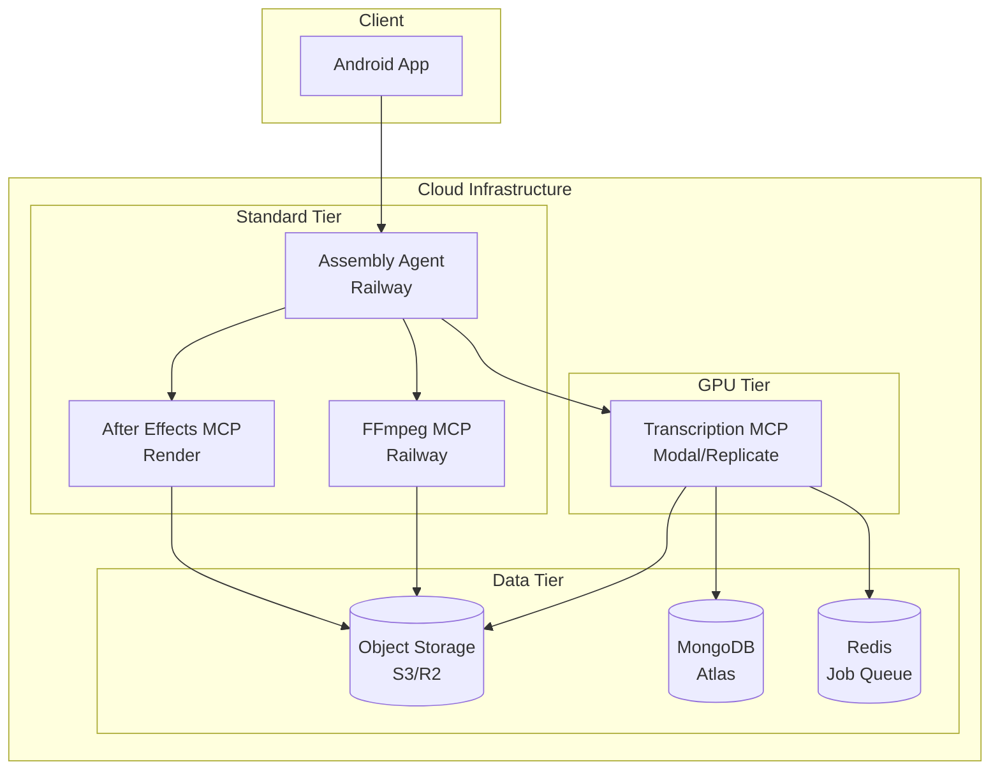

# Architecture Update: Transcription MCP Integration

> See [readme.md](readme.md) for the original architecture and PRD.

## Updated System Architecture

The following diagram extends the existing architecture to include the Transcription MCP for speech-to-text subtitle generation.



## New Component: Transcription MCP

| Property | Value |
|----------|-------|
| **Name** | Transcription MCP |
| **Purpose** | Speech-to-text transcription with subtitle generation |
| **Model** | Faster-Whisper (large-v3) |
| **Outputs** | SRT, VTT, JSON subtitle files + word-level timestamps |

### Responsibilities

1. Accept video/audio files from Object Storage
2. Extract audio (via FFmpeg MCP or internal FFmpeg)
3. Run Faster-Whisper transcription
4. Generate subtitle files in multiple formats
5. Return word-level timestamps for animations
6. Store results in Object Storage and MongoDB

## Detailed Workflow



## Component Interactions

### Data Flow

```
┌─────────────────────────────────────────────────────────────────┐
│                        Object Storage                            │
├─────────────────────────────────────────────────────────────────┤
│  /uploads/           │  /audio/         │  /subtitles/          │
│  └── video_123.mp4   │  └── video_123   │  ├── video_123.srt    │
│                      │      .wav        │  ├── video_123.vtt    │
│                      │                  │  └── video_123.json   │
├─────────────────────────────────────────────────────────────────┤
│  /edited/            │  /compositions/                          │
│  └── video_123       │  └── video_123_animated_subs.mov         │
│      _with_subs.mp4  │                                          │
└─────────────────────────────────────────────────────────────────┘
```

### Tool Registry Update

The Tool Registry must be updated to include the Transcription MCP:

```json
{
  "tools": [
    {
      "name": "transcription-mcp",
      "version": "1.0.0",
      "capabilities": [
        "transcribe",
        "get_supported_languages",
        "get_transcription_status"
      ],
      "input_types": ["video/*", "audio/*"],
      "output_types": ["text/srt", "text/vtt", "application/json"],
      "requires_gpu": true,
      "fallback_available": true
    }
  ]
}
```

## Integration Points

### 1. Assembly Agent Orchestrator

The Assembly Agent now includes transcription as a pre-processing step:

```python
async def process_video_edit(video_url: str, edit_request: EditRequest):
    # Step 1: Transcribe (NEW)
    if edit_request.needs_subtitles:
        transcript = await transcription_mcp.transcribe(
            media_url=video_url,
            options={"word_timestamps": True}
        )
        await mongodb.store_transcript(video_id, transcript)

    # Step 2: Get edit suggestions
    suggestions = await get_retention_suggestions(transcript)

    # Step 3: Apply edits
    if "burn_subtitles" in suggestions:
        await ffmpeg_mcp.burn_subtitles(
            video_url=video_url,
            subtitle_url=transcript.subtitle_files.srt,
            style=suggestions.subtitle_style
        )

    # Step 4: Return to app
    return EditResult(suggestions, edited_assets)
```

### 2. FFmpeg MCP Extensions

New method for subtitle burning:

```json
{
  "method": "burn_subtitles",
  "input": {
    "video_url": "string",
    "subtitle_url": "string",
    "style": {
      "font": "string",
      "size": "integer",
      "color": "string (hex)",
      "outline_color": "string (hex)",
      "position": "top | center | bottom"
    }
  },
  "output": {
    "output_url": "string"
  }
}
```

### 3. After Effects MCP Extensions

New method for animated subtitle layers:

```json
{
  "method": "create_animated_subtitles",
  "input": {
    "word_timings": "[...word timing objects]",
    "style_preset": "viral_tiktok | professional | custom",
    "custom_style": "{ ...style overrides }",
    "output_resolution": "1080x1920 | 1920x1080"
  },
  "output": {
    "composition_url": "string",
    "preview_url": "string"
  }
}
```

## Deployment Architecture



## Rollout Plan

### Phase 1: Basic Transcription
- Deploy Transcription MCP with GPU backend
- Add to Tool Registry
- Basic SRT/VTT generation
- Store results in MongoDB

### Phase 2: FFmpeg Integration
- Add subtitle burning to FFmpeg MCP
- Implement style presets
- End-to-end workflow testing

### Phase 3: Advanced Animations
- After Effects word-by-word animations
- Viral-style subtitle presets
- Custom style support via Retention Corpus

---

**Related Documents:**
- [Transcription MCP Spec](transcription-mcp-spec.md)
- [MongoDB Schema](mongodb-transcription-schema.md)
- [Integration Guide](transcription-integration-guide.md)
