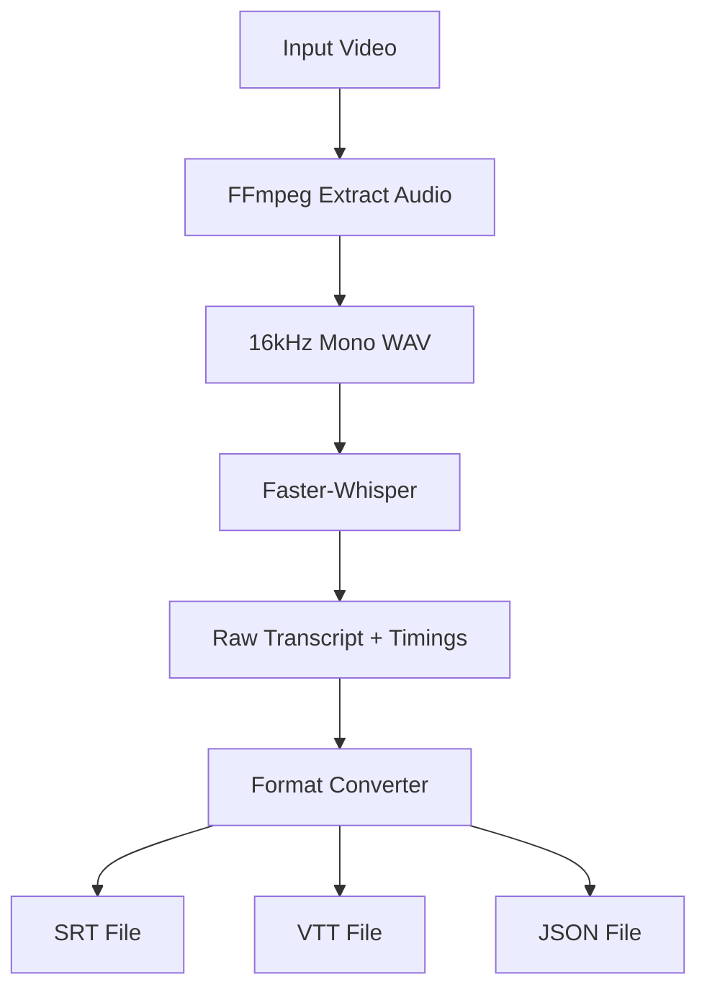
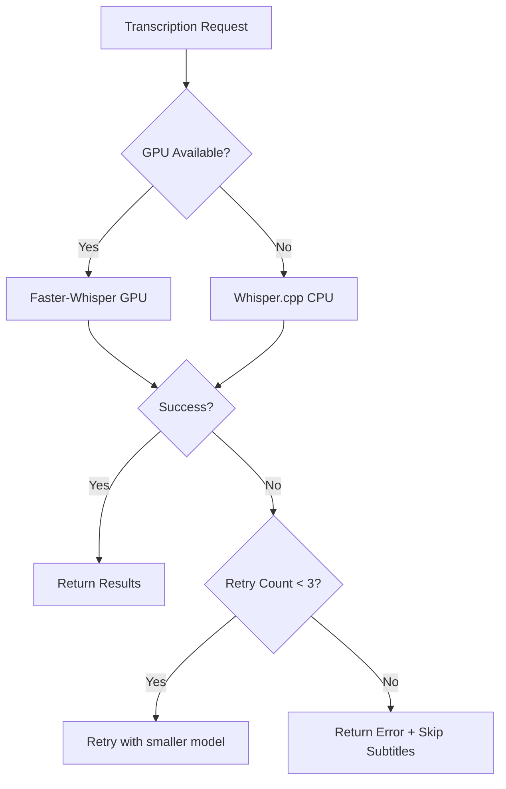

# Transcription MCP Specification

> See [readme.md](readme.md) for overall project architecture and context.

## Overview

The Transcription MCP is a new service component that provides speech-to-text capabilities for the video editing pipeline. It uses **Faster-Whisper** (large-v3 model) to generate accurate transcriptions with word-level timestamps, enabling viral-style subtitle animations.

## Service Definition

```json
{
  "service": "transcription-mcp",
  "version": "1.0.0",
  "description": "Speech-to-text transcription service with subtitle generation",
  "dependencies": ["ffmpeg-mcp", "object-storage"]
}
```

## API Methods

### `transcribe`

Transcribes audio from a video/audio file and generates subtitle files.

#### Input Schema

```json
{
  "media_url": "string (S3/Object Storage path)",
  "options": {
    "model": "string (default: large-v3)",
    "language": "string (optional, auto-detect if omitted)",
    "output_formats": ["srt", "vtt", "json"],
    "word_timestamps": "boolean (default: true)",
    "vad_filter": "boolean (default: true)",
    "beam_size": "integer (default: 5)",
    "best_of": "integer (default: 5)"
  }
}
```

#### Output Schema

```json
{
  "transcript_text": "string",
  "language": "string (ISO 639-1 code)",
  "language_probability": "float (0-1)",
  "confidence": "float (average word confidence)",
  "duration_seconds": "float",
  "subtitle_files": {
    "srt": "string (storage URL)",
    "vtt": "string (storage URL)",
    "json": "string (storage URL)"
  },
  "word_timings": [
    {
      "word": "string",
      "start": "float (seconds)",
      "end": "float (seconds)",
      "confidence": "float (0-1)"
    }
  ],
  "segments": [
    {
      "id": "integer",
      "start": "float",
      "end": "float",
      "text": "string",
      "words": ["...word_timings"]
    }
  ],
  "metadata": {
    "model_version": "string",
    "processing_time_seconds": "float",
    "audio_duration_seconds": "float"
  }
}
```

### `get_supported_languages`

Returns list of supported languages for transcription.

#### Output Schema

```json
{
  "languages": [
    {
      "code": "string (ISO 639-1)",
      "name": "string",
      "native_name": "string"
    }
  ]
}
```

### `get_transcription_status`

Check status of async transcription job.

#### Input Schema

```json
{
  "job_id": "string"
}
```

#### Output Schema

```json
{
  "job_id": "string",
  "status": "queued | processing | completed | failed",
  "progress": "float (0-100)",
  "result": "...transcribe output (if completed)",
  "error": "string (if failed)"
}
```

## Technical Implementation

### Model Deployment Options

| Option | Pros | Cons | Use Case |
|--------|------|------|----------|
| **GPU Server (Modal/Replicate)** | 4x+ realtime speed, best accuracy | Cost per GPU-hour | Production |
| **Railway/Render** | Easy deployment, decent speed | Limited GPU options | Staging |
| **Whisper.cpp (CPU)** | No GPU needed, lower cost | Slower (0.5-1x realtime) | Dev/fallback |

### Recommended Stack

```
FastAPI (Python 3.11+)
├── faster-whisper (CTranslate2 backend)
├── ffmpeg-python (audio extraction)
├── celery + redis (async job queue)
└── boto3 (S3/object storage)
```

### Audio Extraction Pipeline



### FFmpeg Audio Extraction Command

```bash
ffmpeg -i input.mp4 -vn -acodec pcm_s16le -ar 16000 -ac 1 output.wav
```

## Performance Benchmarks

| Model | GPU | Speed | Accuracy (WER) |
|-------|-----|-------|----------------|
| large-v3 | A100 | 10-15x realtime | ~5% |
| large-v3 | T4 | 4-6x realtime | ~5% |
| large-v3 | CPU | 0.3-0.5x realtime | ~5% |
| medium | T4 | 8-10x realtime | ~7% |
| small | T4 | 15-20x realtime | ~10% |

## Error Handling

### Error Codes

| Code | Description | Action |
|------|-------------|--------|
| `AUDIO_EXTRACTION_FAILED` | FFmpeg couldn't extract audio | Check input format |
| `LOW_CONFIDENCE` | Confidence < 0.6 | Flag for manual review |
| `UNSUPPORTED_LANGUAGE` | Language not in model | Return error, suggest alternatives |
| `TIMEOUT` | Processing exceeded limit | Retry with smaller chunks |
| `STORAGE_ERROR` | Failed to upload results | Retry upload |

### Fallback Strategy



## Integration with Existing MCPs

### Coordination with FFmpeg MCP

The Transcription MCP can optionally delegate audio extraction to the existing FFmpeg MCP:

```json
{
  "request_to_ffmpeg_mcp": {
    "method": "extract_audio",
    "input": {
      "video_url": "s3://bucket/video.mp4",
      "output_format": "wav",
      "sample_rate": 16000,
      "channels": 1
    }
  }
}
```

### Output to After Effects MCP

Word timings are formatted for After Effects text layer expressions:

```json
{
  "ae_compatible_timings": {
    "layer_name": "Subtitles",
    "keyframes": [
      {"time": 0.0, "text": "", "opacity": 0},
      {"time": 0.5, "text": "Hello", "opacity": 100},
      {"time": 0.8, "text": "Hello world", "opacity": 100}
    ]
  }
}
```

## Sample Request/Response

### Request

```json
{
  "method": "transcribe",
  "params": {
    "media_url": "s3://content-bucket/uploads/video_abc123.mp4",
    "options": {
      "model": "large-v3",
      "output_formats": ["srt", "vtt", "json"],
      "word_timestamps": true
    }
  }
}
```

### Response

```json
{
  "transcript_text": "Welcome to this tutorial. Today we're going to learn about video editing.",
  "language": "en",
  "language_probability": 0.98,
  "confidence": 0.94,
  "duration_seconds": 5.2,
  "subtitle_files": {
    "srt": "s3://content-bucket/subtitles/video_abc123.srt",
    "vtt": "s3://content-bucket/subtitles/video_abc123.vtt",
    "json": "s3://content-bucket/subtitles/video_abc123.json"
  },
  "word_timings": [
    {"word": "Welcome", "start": 0.0, "end": 0.4, "confidence": 0.97},
    {"word": "to", "start": 0.4, "end": 0.5, "confidence": 0.99},
    {"word": "this", "start": 0.5, "end": 0.7, "confidence": 0.96},
    {"word": "tutorial", "start": 0.7, "end": 1.2, "confidence": 0.94}
  ],
  "metadata": {
    "model_version": "large-v3",
    "processing_time_seconds": 1.3,
    "audio_duration_seconds": 5.2
  }
}
```

## Next Steps

1. Set up GPU-enabled server for Faster-Whisper deployment
2. Implement FastAPI wrapper with async job queue
3. Integrate with existing Tool Registry
4. Add to Assembly Agent orchestration workflow

---

**Related Documents:**
- [Architecture Update](architecture-transcription.md)
- [MongoDB Schema](mongodb-transcription-schema.md)
- [Integration Guide](transcription-integration-guide.md)
- [Subtitle Presets](subtitle-style-presets.md)
